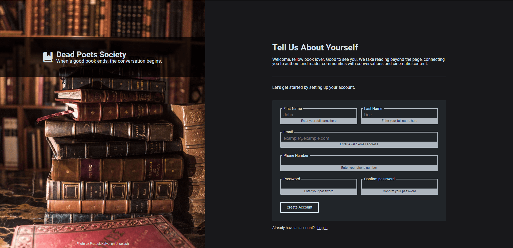

### Project: [Sign-up Form](https://gdimitroff.github.io/sign-up-form/)

A sign-up form prototype for a fictional website made with HTML, CSS and a bit of JavaScript. This project is part of The Odin Project [curriculum](https://www.theodinproject.com/lessons/node-path-intermediate-html-and-css-sign-up-form).

### Features

- Fully **responsive** design
- Added **input** validations with JavaScript

### Outcome

- Used **HTML5 semantic elements** for better structure and readability
- Used **CSS Grid** and **CSS Flexbox** modules to create layout
- Used more complex **CSS Selectors**
- Learned how to implement `:focus`, `focus-within`, `:valid` and `:invalid` pseudo-classes
- Strived to make the **UI** and **UX** as friendly as possible

